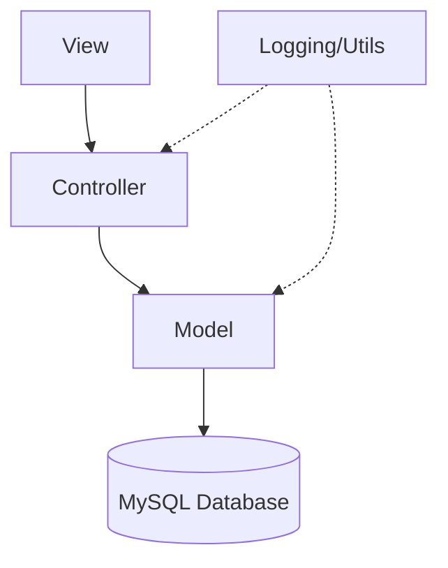

# 🎬 Cinema Pro - Professional Movie Booking System

[](https://www.python.org/)
[](https://www.mysql.com/)
[](#architecture)
[](LICENSE)

**Cinema Pro** is an industry-grade desktop application designed for seamless movie ticket management and booking. Built with a focus on robust architecture, clean code, and user experience, this project demonstrates a complete real-world software engineering lifecycle.

---

## 🚀 Key Features

### 👤 User Module
- **Secure Authentication**: Robust login/signup system with password hashing (bcrypt).
- **Interactive Dashboard**: Search, filter, and browse upcoming movies.
- **Dynamic Seat Selection**: Real-time seat availability grid with premium seat indicators.
- **Booking History**: Track past bookings and view/download generated tickets.
- **E-Ticket Generation**: Automatic PDF ticket generation for confirmed bookings.

### 🛡️ Admin Module
- **Movie Management**: Full CRUD operations for movie records.
- **Show Scheduling**: Map movies to theaters and specific time slots.
- **Theater Control**: Manage theater capacity and seat mappings.

---

## 🏗️ Architecture

The project follows a **Layered MVC (Model-View-Controller)** pattern:

- **Models**: Handled via a robust data access layer (`BaseModel`) with transaction support.
- **Controllers**: Centralized business logic (Service Layer) for Auth and Bookings.
- **Views**: Modern, responsive UI built with **CustomTkinter**.
- **Utils**: Utility layer for PDF generation, Logging, and Configuration.



---

## 🛠️ Tech Stack

- **Language**: Python 3.12+
- **Database**: MySQL (Relational Schema)
- **GUI Framework**: CustomTkinter (Modern Dark UI)
- **Security**: Bcrypt (Hashing)
- **Reporting**: ReportLab (PDF Generation)
- **Config**: Environment Variable support (.env)

---

## ⚙️ Setup & Installation

### Prerequisites
- MySQL Server installed and running.
- Python 3.x installed.

### Commands
1. **Clone the repo**:
   ```bash
   git clone https://github.com/suryanshagrawal21/Movie-Booking-System.git
   cd Movie-Booking-System
   ```
2. **Install Dependencies**:
   ```bash
   pip install -r requirements.txt
   ```
3. **Configure Environment**:
   - Create a `.env` file based on `.env.example`.
   - Update your MySQL credentials.
4. **Initialize Database**:
   ```bash
   python database/setup_v2.py
   ```
5. **Run Application**:
   ```bash
   python run.py
   ```

---

## 👨‍💻 Interview Readiness

This project was built following industry best practices:
- **Clean Code**: SOLID principles and consistent naming conventions.
- **Error Handling**: Centralized try-catch blocks and logging.
- **Concurrency**: Transaction-safe seat booking logic.
- **Security**: No hardcoded credentials; handled via environment variables.

*See [docs/interview_prep.md](docs/interview_prep.md) for a detailed pitch guide and common Q&A.*

---

## 🔮 Future Improvements
- [ ] Integration with real Payment Gateways (Stripe/PayPal API).
- [ ] Email notifications using SMTP (concept implemented).
- [ ] Web-based dashboard using Flask/Django.
- [ ] Machine Learning based movie recommendations.
